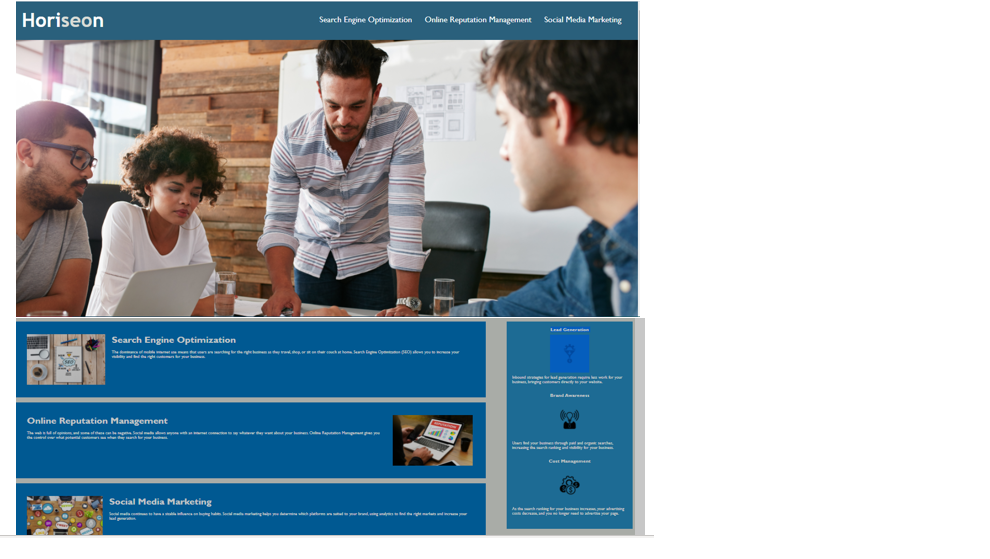

# Challenge-1 Git-Refactor
HTML and css code for Horiseon website. Change the code on html and 
css and keep the same website. Easy to understand and make simple.

# Languages used
    HTML
    CSS

# User Story
    AS A marketing agency
    I WANT a codebase that follows accessibility standards
    SO THAT our own site is optimized for search engines

# Github Link
    https://github.com/patelpr03/Project1-Refactor
    
# Live Application Link
    https://patelpr03.github.io/Project1-Refactor/
# Screenshot

